# Agent Engine

<div align="center">

**Claude Code Agentic Engine - Go Edition**

[](LICENSE)
[](https://golang.org)

**English** | [Chinese](README_CN.md)

</div>

---

## 1. Project Description

A complete Go rewrite of the Claude Code agentic engine core, extracted from the TypeScript implementation. This project provides a powerful, extensible AI agent engine with multi-provider support, tool orchestration, and multi-agent coordination capabilities.

## Architecture

### Architecture Diagram

```mermaid
graph TB
    subgraph "Entry Points"
        HTTP[HTTP Server<br/>chi + SSE]
        CLI[CLI/TUI<br/>BubbleTea]
        SDK[Go SDK]
    end

    subgraph "Core Engine"
        Engine[Engine<br/>Session Manager]
        QueryLoop[Query Loop<br/>Multi-turn Context]
        ToolExec[Tool Executor<br/>Parallel Execution]
        Context[Context Pipeline<br/>Compaction & Prefetch]
        TokenBudget[Token Budget<br/>Smart Truncation]
    end

    subgraph "LLM Providers"
        Factory[Provider Factory]
        Anthropic[Anthropic API<br/>Native Support]
        OpenAI[OpenAI Compatible<br/>MiniMax/VLLM/OpenRouter]
        CB[Circuit Breaker]
        RL[Rate Limiter]
        Retry[Retry Logic]
    end

    subgraph "Tool System"
        Registry[Tool Registry]
        Bash[Bash/PowerShell<br/>Sandboxed Execution]
        FileTools[File Tools<br/>Read/Edit/Write/Glob/Grep]
        WebTools[Web Tools<br/>Fetch/Search]
        AgentTool[Agent Tool<br/>Sub-Agent Spawner]
        MCP[MCP Tools<br/>External Integrations]
        Misc[Other Tools<br/>Ask/Todo/Sleep/Cron]
    end

    subgraph "Support Systems"
        Memory[Memory System<br/>CLAUDE.md + LLM Extractor]
        Permission[Permission System<br/>Auto/Bypass/Plan]
        Plugin[Plugin System<br/>hashicorp/go-plugin]
        Session[Session Storage<br/>JSONL Transcripts]
        Hooks[Event Hooks<br/>Lifecycle Events]
        Analytics[Analytics<br/>Session Tracking]
    end

    subgraph "Multi-Agent"
        Coordinator[Agent Coordinator]
        SubAgent[Sub-Agent<br/>Task Delegation]
        Buddy[Buddy System<br/>Mulberry32 PRNG]
    end

    subgraph "Modes"
        AutoMode[Auto Mode<br/>Autonomous Execution]
        Undercover[Undercover Mode<br/>Stealth Operations]
        FastMode[Fast Mode<br/>Optimized Responses]
    end

    HTTP --> Engine
    CLI --> Engine
    SDK --> Engine

    Engine --> QueryLoop
    QueryLoop --> ToolExec
    QueryLoop --> Context
    Context --> TokenBudget

    Engine --> Factory
    Factory --> Anthropic
    Factory --> OpenAI
    Factory --> CB
    Factory --> RL
    Factory --> Retry

    ToolExec --> Registry
    Registry --> Bash
    Registry --> FileTools
    Registry --> WebTools
    Registry --> AgentTool
    Registry --> MCP
    Registry --> Misc

    Engine --> Memory
    Engine --> Permission
    Engine --> Plugin
    Engine --> Session
    Engine --> Hooks
    Engine --> Analytics

    Engine --> Coordinator
    Coordinator --> SubAgent
    Coordinator --> Buddy

    Engine --> AutoMode
    Engine --> Undercover
    Engine --> FastMode
```



### Directory Structure

```
agent-engine/
├── cmd/agent-engine/          # HTTP server entry point
├── pkg/sdk/                   # Public Go SDK
├── internal/
│   ├── engine/                # Core query loop, types, context compaction
│   ├── provider/              # LLM provider adapters (Anthropic, OpenAI-compat)
│   ├── tool/                  # Tool interface, registry, orchestration
│   │   ├── bash/              # BashTool
│   │   ├── fileread/          # Read (file viewer)
│   │   ├── fileedit/          # Edit (find-and-replace)
│   │   ├── filewrite/         # Write (create/overwrite)
│   │   ├── grep/              # Grep (ripgrep wrapper)
│   │   ├── glob/              # Glob (doublestar)
│   │   ├── webfetch/          # WebFetch (HTML→Markdown)
│   │   ├── websearch/         # WebSearch
│   │   ├── askuser/           # AskUser
│   │   ├── todo/              # TodoWrite
│   │   ├── sendmessage/       # SendMessage
│   │   ├── sleep/             # Sleep
│   │   ├── taskstop/          # TaskStop
│   │   ├── notebookedit/      # NotebookEdit (.ipynb)
│   │   ├── brief/             # Brief (progress summary)
│   │   ├── cron/              # ScheduleCron
│   │   └── agentool/          # Task (sub-agent spawner)
│   ├── prompt/                # 6-layer system prompt assembly + cache
│   ├── permission/            # Permission checker + rules
│   ├── mode/                  # Undercover, AutoMode, FastMode, SideQuery
│   ├── skill/                 # Markdown skill loader
│   ├── plugin/                # hashicorp/go-plugin external tools
│   ├── buddy/                 # Companion system (Mulberry32 PRNG)
│   ├── memory/                # CLAUDE.md reader + LLM memory extractor
│   ├── session/               # JSONL transcript storage
│   ├── command/               # Slash command registry + built-ins
│   ├── agent/                 # Multi-agent coordinator
│   ├── daemon/                # Long-running background process (fsnotify)
│   ├── state/                 # AppState store + session state
│   ├── server/                # chi HTTP server + SSE streaming
│   └── util/                  # Errors, path, file, shell, cwd, format, env, …
└── embed/prompts/             # Embedded system prompt templates
```

## 2. Core Modules

| Module | Description |
|--------|-------------|
| **Engine** | Core query loop with multi-turn context and message persistence |
| **Provider** | Multi-LLM support (Anthropic, OpenAI, MiniMax, VLLM, OpenRouter) |
| **Tool System** | 17+ built-in tools (Bash, FileEdit, Grep, WebFetch, AskUser, etc.) |
| **Prompt Builder** | 6-layer system prompt assembly with caching |
| **Multi-Agent** | Sub-agent spawning and coordination framework |
| **Memory** | CLAUDE.md reader + LLM-based memory extraction |
| **Permission** | Flexible permission modes (auto, bypass, plan, acceptEdits) |
| **Plugin** | External tool support via hashicorp/go-plugin |
| **TUI** | Interactive terminal UI with BubbleTea framework |
| **HTTP Server** | RESTful API with SSE streaming support |

---

## 3. Quick Start

### Installation

```bash
# Clone the repository
git clone https://github.com/wall-ai/agent-engine.git
cd agent-engine

# Set your API key
export ANTHROPIC_API_KEY=sk-ant-...
# Or use OpenAI-compatible APIs
export AGENT_ENGINE_PROVIDER=openai
export AGENT_ENGINE_API_KEY=sk-...
export AGENT_ENGINE_BASE_URL=https://api.openai.com/v1

# Build and run
make build
./bin/agent-engine serve
```

## HTTP API

### API Endpoints

#### Create a Session
```bash
curl -X POST http://localhost:8080/api/v1/sessions \
  -H 'Content-Type: application/json' \
  -d '{"work_dir": "/path/to/project"}'
# → {"session_id":"<uuid>"}
```

#### Send a Message (Streaming)
```bash
curl -X POST http://localhost:8080/api/v1/sessions/<id>/messages \
  -H 'Content-Type: application/json' \
  -d '{"text":"Explain this codebase","stream":true}'
```

#### Delete a Session
```bash
curl -X DELETE http://localhost:8080/api/v1/sessions/<id>
```

## Go SDK

```go
import "github.com/wall-ai/agent-engine/pkg/sdk"

eng, err := sdk.New(
    sdk.WithWorkDir("/my/project"),
    sdk.WithAPIKey(os.Getenv("ANTHROPIC_API_KEY")),
    sdk.WithModel("claude-sonnet-4-5"),
)
if err != nil {
    log.Fatal(err)
}
defer eng.Close()

ctx := context.Background()
events := eng.SubmitMessage(ctx, "Refactor the auth module")
for ev := range events {
    if ev.Type == engine.EventTextDelta {
        fmt.Print(ev.Text)
    }
}
```

### Configuration

| Key | Default | Description |
|-----|---------|-------------|
| `provider` | `anthropic` | LLM provider (anthropic/openai) |
| `model` | `claude-sonnet-4-5` | Model name |
| `max_tokens` | `8192` | Maximum output tokens |
| `http_port` | `8080` | HTTP listen port |
| `auto_mode` | `false` | Enable Auto Mode |

---

## 4. Acknowledgments

This project is a Go rewrite inspired by the original [Claude Code](https://github.com/anthropics/claude-code) TypeScript implementation by Anthropic.

Special thanks to:
- **Anthropic** for the original Claude Code architecture
- **Go community** for excellent libraries (BubbleTea, chi, hashicorp/go-plugin)
- **All contributors** who helped improve this project

---

## 5. Star History

<a href="https://www.star-history.com/#wall-ai/agent-engine&Date">
 <picture>
   <source media="(prefers-color-scheme: dark)" srcset="https://api.star-history.com/svg?repos=wall-ai/agent-engine&type=Date&theme=dark" />
   <source media="(prefers-color-scheme: light)" srcset="https://api.star-history.com/svg?repos=wall-ai/agent-engine&type=Date" />
   
 </picture>
</a>

---

## License

MIT License - see [LICENSE](LICENSE) for details.
