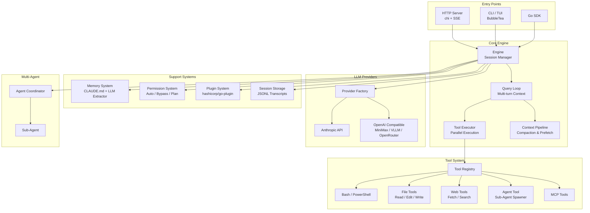

# Open Claude Code Go

<div align="center">

**A production-grade Go rewrite of the Claude Code agentic engine**

[](LICENSE)
[](https://golang.org)

**English** | [中文](README_CN.md)

</div>

---

## Overview

Open Claude Code Go is a complete Go reimplementation of the [Claude Code](https://github.com/codeChef8500/open-claude-code/tree/main/claude-code-main/claude-code-main) TypeScript agentic engine. It provides a powerful, extensible AI agent runtime with multi-LLM provider support, parallel tool orchestration, multi-agent coordination, and both HTTP and TUI interfaces.

## Architecture



## Directory Structure

```
open-claudecode-go/
├── cmd/agent-engine/          # CLI entry point (HTTP server + TUI)
├── pkg/sdk/                   # Public Go SDK
├── internal/
│   ├── engine/                # Core query loop, context compaction, token budget
│   ├── provider/              # LLM adapters: Anthropic, OpenAI-compat, circuit breaker
│   ├── tool/                  # Tool interface, registry, and built-ins
│   │   ├── bash/              # Bash / PowerShell execution
│   │   ├── fileread/          # Read files
│   │   ├── fileedit/          # Edit (find-and-replace)
│   │   ├── filewrite/         # Write / create files
│   │   ├── grep/              # Grep (ripgrep wrapper)
│   │   ├── glob/              # Glob (doublestar)
│   │   ├── webfetch/          # WebFetch (HTML → Markdown)
│   │   ├── websearch/         # Web search
│   │   ├── askuser/           # Interactive user prompts
│   │   ├── agentool/          # Sub-agent task spawner
│   │   ├── notebookedit/      # Jupyter notebook editing
│   │   ├── cron/              # Scheduled tasks
│   │   └── mcptool/           # MCP protocol tools
│   ├── prompt/                # 6-layer system prompt assembly + cache
│   ├── permission/            # Permission checker and rules
│   ├── mode/                  # AutoMode, Undercover, FastMode, SideQuery
│   ├── memory/                # CLAUDE.md reader + LLM memory extractor
│   ├── session/               # JSONL transcript storage
│   ├── agent/                 # Multi-agent coordinator
│   ├── plugin/                # hashicorp/go-plugin external tools
│   ├── daemon/                # Background daemon (fsnotify)
│   ├── server/                # chi HTTP server + SSE streaming
│   ├── tui/                   # Terminal UI (BubbleTea)
│   ├── hooks/                 # Lifecycle event hooks
│   ├── analytics/             # Session tracking
│   └── util/                  # Shared utilities
└── embed/prompts/             # Embedded system prompt templates
```

---

## Core Modules

| Module | Description |
|--------|-------------|
| **Engine** | Multi-turn query loop with context compaction and token budget management |
| **Provider** | Anthropic native + OpenAI-compatible adapters with circuit breaker and rate limiting |
| **Tool System** | 20+ built-in tools with parallel execution support |
| **Prompt Builder** | 6-layer system prompt assembly with prompt caching |
| **Multi-Agent** | Sub-agent spawning, coordination, and task delegation |
| **Memory** | `CLAUDE.md` project memory + LLM-based memory extraction |
| **Permission** | Per-tool permission modes: `auto`, `bypass`, `plan`, `acceptEdits` |
| **Plugin** | External tool plugins via `hashicorp/go-plugin` (gRPC) |
| **TUI** | Full-featured interactive terminal UI built with BubbleTea |
| **HTTP Server** | RESTful API with SSE streaming via chi router |

---

## Quick Start

### Prerequisites

- Go 1.24+
- An API key for Anthropic or any OpenAI-compatible provider

### Build & Run

```bash
git clone https://github.com/wall-ai/agent-engine.git
cd agent-engine

# Build
make build

# Run as HTTP server
./bin/agent-engine serve

# Run interactive TUI
./bin/agent-engine
```

### Environment Variables

```bash
# Anthropic
export ANTHROPIC_API_KEY=sk-ant-...

# OpenAI-compatible (MiniMax, VLLM, OpenRouter, etc.)
export AGENT_ENGINE_PROVIDER=openai
export AGENT_ENGINE_API_KEY=sk-...
export AGENT_ENGINE_BASE_URL=https://api.openai.com/v1
export AGENT_ENGINE_MODEL=gpt-4o
```

---

## HTTP API

### Create a Session

```bash
curl -X POST http://localhost:8080/api/v1/sessions \
  -H 'Content-Type: application/json' \
  -d '{"work_dir": "/path/to/project"}'
# → {"session_id":"<uuid>"}
```

### Send a Message (Streaming SSE)

```bash
curl -X POST http://localhost:8080/api/v1/sessions/<id>/messages \
  -H 'Content-Type: application/json' \
  -d '{"text": "Explain this codebase", "stream": true}'
```

### Delete a Session

```bash
curl -X DELETE http://localhost:8080/api/v1/sessions/<id>
```

---

## Go SDK

```go
import (
    "context"
    "fmt"
    "os"

    "github.com/wall-ai/agent-engine/internal/engine"
    "github.com/wall-ai/agent-engine/pkg/sdk"
)

eng, err := sdk.New(
    sdk.WithWorkDir("/my/project"),
    sdk.WithAPIKey(os.Getenv("ANTHROPIC_API_KEY")),
    sdk.WithModel("claude-sonnet-4-5"),
)
if err != nil {
    log.Fatal(err)
}
defer eng.Close()

events := eng.SubmitMessage(context.Background(), "Refactor the auth module")
for ev := range events {
    if ev.Type == engine.EventTextDelta {
        fmt.Print(ev.Text)
    }
}
```

### SDK Configuration Options

| Option | Default | Description |
|--------|---------|-------------|
| `WithWorkDir(path)` | required | Working directory for the session |
| `WithAPIKey(key)` | `$ANTHROPIC_API_KEY` | LLM provider API key |
| `WithModel(name)` | `claude-sonnet-4-5` | Model identifier |
| `WithProvider(name)` | `anthropic` | Provider: `anthropic` or `openai` |
| `WithMaxTokens(n)` | `8192` | Maximum output tokens |
| `WithAutoMode(bool)` | `false` | Enable autonomous execution mode |

---

## Acknowledgments

This project is inspired by and based on the original [Claude Code](https://github.com/anthropics/claude-code) TypeScript implementation by Anthropic.

Special thanks to:
- **Anthropic** for the original Claude Code architecture and Claude models
- **The Go community** for excellent libraries: BubbleTea, chi, hashicorp/go-plugin
- **All contributors** who help improve this project

---

## Star History

<a href="https://www.star-history.com/#wall-ai/agent-engine&Date">
 <picture>
   <source media="(prefers-color-scheme: dark)" srcset="https://api.star-history.com/svg?repos=wall-ai/agent-engine&type=Date&theme=dark" />
   <source media="(prefers-color-scheme: light)" srcset="https://api.star-history.com/svg?repos=wall-ai/agent-engine&type=Date" />
   
 </picture>
</a>

---

## License

MIT License — see [LICENSE](LICENSE) for details.
