# Open Claude Code Go

<div align="center">

**Claude Code Agentic Engine - Go Edition**

[](LICENSE)
[](https://golang.org)

[English](README.md) | **Chinese**

</div>

---

## 1. 项目描述

Claude Code TypeScript 实现的 Go 语言重写版本。本项目提供了一个强大、可扩展的 AI Agent 引擎，支持多 LLM 提供商、工具编排和多 Agent 协调能力。

### Architecture Diagram

```mermaid
graph TB
    subgraph "Entry Points"
        HTTP[HTTP Server<br/>chi + SSE]
        CLI[CLI/TUI<br/>BubbleTea]
        SDK[Go SDK]
    end

    subgraph "Core Engine"
        Engine[Engine<br/>Session Manager]
        QueryLoop[Query Loop<br/>Multi-turn Context]
        ToolExec[Tool Executor<br/>Parallel Execution]
        Context[Context Pipeline<br/>Compaction & Prefetch]
        TokenBudget[Token Budget<br/>Smart Truncation]
    end

    subgraph "LLM Providers"
        Factory[Provider Factory]
        Anthropic[Anthropic API<br/>Native Support]
        OpenAI[OpenAI Compatible<br/>MiniMax/VLLM/OpenRouter]
    end

    subgraph "Tool System"
        Registry[Tool Registry]
        Bash[Bash/PowerShell<br/>Sandboxed Execution]
        FileTools[File Tools<br/>Read/Edit/Write/Glob/Grep]
        WebTools[Web Tools<br/>Fetch/Search]
        AgentTool[Agent Tool<br/>Sub-Agent Spawner]
        MCP[MCP Tools<br/>External Integrations]
        Misc[Other Tools<br/>Ask/Todo/Sleep/Cron]
    end

    subgraph "Support Systems"
        Memory[Memory System<br/>CLAUDE.md + LLM Extractor]
        Permission[Permission System<br/>Auto/Bypass/Plan]
        Plugin[Plugin System<br/>hashicorp/go-plugin]
        Session[Session Storage<br/>JSONL Transcripts]
        Hooks[Event Hooks<br/>Lifecycle Events]
        Analytics[Analytics<br/>Session Tracking]
    end

    subgraph "Multi-Agent"
        Coordinator[Agent Coordinator]
        SubAgent[Sub-Agent<br/>Task Delegation]
        Buddy[Buddy System<br/>Mulberry32 PRNG]
    end

    subgraph "Modes"
        AutoMode[Auto Mode<br/>Autonomous Execution]
        Undercover[Undercover Mode<br/>Stealth Operations]
        FastMode[Fast Mode<br/>Optimized Responses]
    end

    HTTP --> Engine
    CLI --> Engine
    SDK --> Engine

    Engine --> QueryLoop
    QueryLoop --> ToolExec
    QueryLoop --> Context
    Context --> TokenBudget

    Engine --> Factory
    Factory --> Anthropic
    Factory --> OpenAI
    Factory --> CB
    Factory --> RL
    Factory --> Retry

    ToolExec --> Registry
    Registry --> Bash
    Registry --> FileTools
    Registry --> WebTools
    Registry --> AgentTool
    Registry --> MCP
    Registry --> Misc

    Engine --> Memory
    Engine --> Permission
    Engine --> Plugin
    Engine --> Session
    Engine --> Hooks
    Engine --> Analytics

    Engine --> Coordinator
    Coordinator --> SubAgent
    Coordinator --> Buddy

    Engine --> AutoMode
    Engine --> Undercover
    Engine --> FastMode
```



### Directory Structure

```
agent-engine/
|-- cmd/agent-engine/          # HTTP server entry point
|-- pkg/sdk/                   # Public Go SDK
|-- internal/
|   |-- engine/                # Core query loop, types, context compaction
|   |-- provider/              # LLM provider adapters (Anthropic, OpenAI-compat)
|   |-- tool/                  # Tool interface, registry, orchestration
|   |-- prompt/                # 6-layer system prompt assembly + cache
|   |-- permission/            # Permission checker + rules
|   |-- mode/                  # Undercover, AutoMode, FastMode, SideQuery
|   |-- skill/                 # Markdown skill loader
|   |-- plugin/                # hashicorp/go-plugin external tools
|   |-- buddy/                 # Companion system (Mulberry32 PRNG)
|   |-- memory/                # CLAUDE.md reader + LLM memory extractor
|   |-- session/               # JSONL transcript storage
|   |-- command/               # Slash command registry + built-ins
|   |-- agent/                 # Multi-agent coordinator
|   |-- daemon/                # Long-running background process (fsnotify)
|   |-- state/                 # AppState store + session state
|   |-- server/                # chi HTTP server + SSE streaming
|   |-- tui/                   # Terminal UI (BubbleTea)
|   |-- hooks/                 # Event hooks system
|   |-- analytics/             # Session tracking & analytics
|   |-- service/               # Business logic services
|   |-- toolset/               # Tool grouping and management
|   |-- util/                  # Errors, path, file, shell, cwd, format, env
|-- embed/prompts/             # Embedded system prompt templates
```

---

## 2. 核心模块

| 模块 | 描述 |
|------|------|
| **Engine** | 核心查询循环，支持多轮对话上下文和消息持久化 |
| **Provider** | 多 LLM 支持（Anthropic、OpenAI、MiniMax、VLLM、OpenRouter） |
| **Tool System** | 17+ 内置工具（Bash、FileEdit、Grep、WebFetch、AskUser 等） |
| **Prompt Builder** | 6 层系统提示词组装与缓存 |
| **Multi-Agent** | 子 Agent 生成与协调框架 |
| **Memory** | CLAUDE.md 读取器 + 基于 LLM 的记忆提取 |
| **Permission** | 灵活的权限模式（auto、bypass、plan、acceptEdits） |
| **Plugin** | 通过 hashicorp/go-plugin 支持外部工具 |
| **TUI** | 基于 BubbleTea 框架的交互式终端 UI |
| **HTTP Server** | 支持 SSE 流式传输的 RESTful API |

---

## 3. 快速开始

### 安装

```bash
# Clone the repository
git clone https://github.com/wall-ai/agent-engine.git
cd agent-engine

# Set your API key
export ANTHROPIC_API_KEY=sk-ant-...
# Or use OpenAI-compatible APIs
export AGENT_ENGINE_PROVIDER=openai
export AGENT_ENGINE_API_KEY=sk-...
export AGENT_ENGINE_BASE_URL=https://api.openai.com/v1

# Build and run
make build
./bin/agent-engine serve
```

### HTTP API

```bash
# 创建会话
curl -X POST http://localhost:8080/api/v1/sessions \
  -H 'Content-Type: application/json' \
  -d '{"work_dir": "/path/to/project"}'
# 返回：{"session_id":"<uuid>"}

# 发送消息（流式）
curl -X POST http://localhost:8080/api/v1/sessions/<id>/messages \
  -H 'Content-Type: application/json' \
  -d '{"text":"解释这个代码库","stream":true}'
```

### Go SDK

```go
import "github.com/wall-ai/agent-engine/pkg/sdk"

eng, err := sdk.New(
    sdk.WithWorkDir("/my/project"),
    sdk.WithAPIKey(os.Getenv("ANTHROPIC_API_KEY")),
    sdk.WithModel("claude-sonnet-4-5"),
)
if err != nil {
    log.Fatal(err)
}
defer eng.Close()

ctx := context.Background()
events := eng.SubmitMessage(ctx, "重构认证模块")
for ev := range events {
    if ev.Type == engine.EventTextDelta {
        fmt.Print(ev.Text)
    }
}
```

### 配置

| 配置项 | 默认值 | 描述 |
|--------|--------|------|
| `provider` | `anthropic` | LLM 提供商（anthropic/openai） |
| `model` | `claude-sonnet-4-5` | 模型名称 |
| `max_tokens` | `8192` | 最大输出 token 数 |
| `http_port` | `8080` | HTTP 监听端口 |
| `auto_mode` | `false` | 启用自动模式 |

---

## 4. 致谢

本项目是对 Anthropic 原始 [Claude Code](https://github.com/anthropics/claude-code) TypeScript 实现的 Go 语言重写。

特别感谢：
- **Anthropic** 提供原始 Claude Code 架构
- **Go 社区** 提供优秀的库（BubbleTea、chi、hashicorp/go-plugin）
- **所有贡献者** 帮助改进本项目

---

## 5. Star 历史

<a href="https://www.star-history.com/#wall-ai/agent-engine&Date">
 <picture>
   <source media="(prefers-color-scheme: dark)" srcset="https://api.star-history.com/svg?repos=wall-ai/agent-engine&type=Date&theme=dark" />
   <source media="(prefers-color-scheme: light)" srcset="https://api.star-history.com/svg?repos=wall-ai/agent-engine&type=Date" />
   
 </picture>
</a>

---

## 许可证

MIT 许可证 - 详情见 [LICENSE](LICENSE)。
