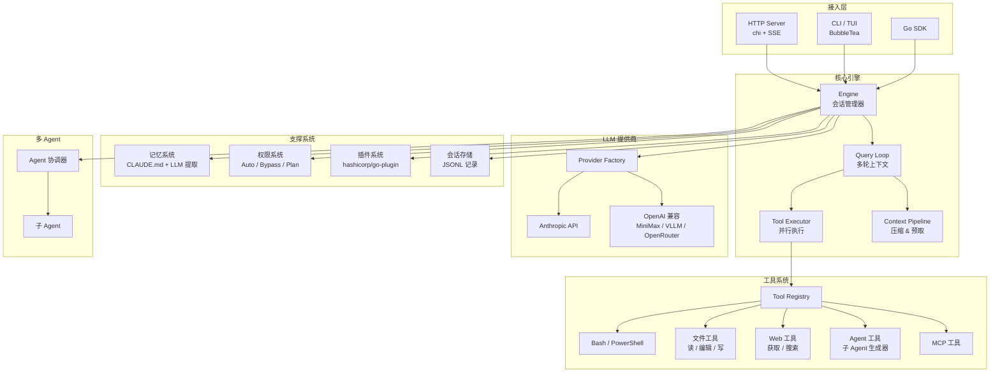

# Open Claude Code Go

<div align="center">

**Claude Code Agentic Engine 的 Go 语言重写版本**

[](LICENSE)
[](https://golang.org)

[English](README.md) | **中文**

</div>

---

## 项目简介

Open Claude Code Go 是 Anthropic [Claude Code](https://github.com/codeChef8500/open-claude-code/tree/main/claude-code-main/claude-code-main) TypeScript Agentic Engine 的完整 Go 语言重写版本。提供强大、可扩展的 AI Agent 运行时，支持多 LLM 提供商、并行工具编排、多 Agent 协调，以及 HTTP 和 TUI 双接口。

## 架构



## 目录结构

```
open-claudecode-go/
├── cmd/agent-engine/          # CLI 入口（HTTP 服务 + TUI）
├── pkg/sdk/                   # 公开 Go SDK
├── internal/
│   ├── engine/                # 核心查询循环、上下文压缩、Token 预算
│   ├── provider/              # LLM 适配器：Anthropic、OpenAI 兼容、熔断器
│   ├── tool/                  # 工具接口、注册表及内置工具
│   │   ├── bash/              # Bash / PowerShell 执行
│   │   ├── fileread/          # 文件读取
│   │   ├── fileedit/          # 文件编辑（查找替换）
│   │   ├── filewrite/         # 文件写入 / 创建
│   │   ├── grep/              # Grep（ripgrep 封装）
│   │   ├── glob/              # Glob（doublestar）
│   │   ├── webfetch/          # WebFetch（HTML → Markdown）
│   │   ├── websearch/         # 网络搜索
│   │   ├── askuser/           # 交互式用户提示
│   │   ├── agentool/          # 子 Agent 任务生成器
│   │   ├── notebookedit/      # Jupyter Notebook 编辑
│   │   ├── cron/              # 定时任务
│   │   └── mcptool/           # MCP 协议工具
│   ├── prompt/                # 6 层系统提示词组装 + 缓存
│   ├── permission/            # 权限检查器与规则
│   ├── mode/                  # AutoMode、Undercover、FastMode、SideQuery
│   ├── memory/                # CLAUDE.md 读取器 + LLM 记忆提取
│   ├── session/               # JSONL 记录存储
│   ├── agent/                 # 多 Agent 协调器
│   ├── plugin/                # hashicorp/go-plugin 外部工具
│   ├── daemon/                # 后台守护进程（fsnotify）
│   ├── server/                # chi HTTP 服务器 + SSE 流式传输
│   ├── tui/                   # 终端 UI（BubbleTea）
│   ├── hooks/                 # 生命周期事件钩子
│   ├── analytics/             # 会话追踪
│   └── util/                  # 公共工具函数
└── embed/prompts/             # 嵌入式系统提示词模板
```

---

## 核心模块

| 模块 | 描述 |
|------|------|
| **Engine** | 多轮查询循环，支持上下文压缩和 Token 预算管理 |
| **Provider** | Anthropic 原生 + OpenAI 兼容适配器，含熔断器和限流 |
| **Tool System** | 20+ 内置工具，支持并行执行 |
| **Prompt Builder** | 6 层系统提示词组装，支持 Prompt 缓存 |
| **Multi-Agent** | 子 Agent 生成、协调与任务委托 |
| **Memory** | `CLAUDE.md` 项目记忆 + 基于 LLM 的记忆提取 |
| **Permission** | 细粒度权限模式：`auto`、`bypass`、`plan`、`acceptEdits` |
| **Plugin** | 通过 `hashicorp/go-plugin`（gRPC）支持外部工具插件 |
| **TUI** | 基于 BubbleTea 的全功能交互式终端 UI |
| **HTTP Server** | 基于 chi 路由的 RESTful API，支持 SSE 流式传输 |

---

## 快速开始

### 环境要求

- Go 1.24+
- Anthropic 或任意 OpenAI 兼容提供商的 API Key

### 构建与运行

```bash
git clone https://github.com/wall-ai/agent-engine.git
cd agent-engine

# 构建
make build

# 启动 HTTP 服务
./bin/agent-engine serve

# 启动交互式 TUI
./bin/agent-engine
```

### 环境变量

```bash
# Anthropic
export ANTHROPIC_API_KEY=sk-ant-...

# OpenAI 兼容（MiniMax、VLLM、OpenRouter 等）
export AGENT_ENGINE_PROVIDER=openai
export AGENT_ENGINE_API_KEY=sk-...
export AGENT_ENGINE_BASE_URL=https://api.openai.com/v1
export AGENT_ENGINE_MODEL=gpt-4o
```

---

## HTTP API

### 创建会话

```bash
curl -X POST http://localhost:8080/api/v1/sessions \
  -H 'Content-Type: application/json' \
  -d '{"work_dir": "/path/to/project"}'
# → {"session_id":"<uuid>"}
```

### 发送消息（SSE 流式）

```bash
curl -X POST http://localhost:8080/api/v1/sessions/<id>/messages \
  -H 'Content-Type: application/json' \
  -d '{"text": "解释这个代码库", "stream": true}'
```

### 删除会话

```bash
curl -X DELETE http://localhost:8080/api/v1/sessions/<id>
```

---

## Go SDK

```go
import (
    "context"
    "fmt"
    "os"

    "github.com/wall-ai/agent-engine/internal/engine"
    "github.com/wall-ai/agent-engine/pkg/sdk"
)

eng, err := sdk.New(
    sdk.WithWorkDir("/my/project"),
    sdk.WithAPIKey(os.Getenv("ANTHROPIC_API_KEY")),
    sdk.WithModel("claude-sonnet-4-5"),
)
if err != nil {
    log.Fatal(err)
}
defer eng.Close()

events := eng.SubmitMessage(context.Background(), "重构认证模块")
for ev := range events {
    if ev.Type == engine.EventTextDelta {
        fmt.Print(ev.Text)
    }
}
```

### SDK 配置项

| 选项 | 默认值 | 描述 |
|------|--------|------|
| `WithWorkDir(path)` | 必填 | 会话工作目录 |
| `WithAPIKey(key)` | `$ANTHROPIC_API_KEY` | LLM 提供商 API Key |
| `WithModel(name)` | `claude-sonnet-4-5` | 模型标识符 |
| `WithProvider(name)` | `anthropic` | 提供商：`anthropic` 或 `openai` |
| `WithMaxTokens(n)` | `8192` | 最大输出 Token 数 |
| `WithAutoMode(bool)` | `false` | 启用自主执行模式 |

---

## 致谢

本项目受 Anthropic 原始 [Claude Code](https://github.com/anthropics/claude-code) TypeScript 实现启发并基于其架构开发。

特别感谢：
- **Anthropic** 提供原始 Claude Code 架构与 Claude 模型
- **Go 社区** 提供优秀的开源库：BubbleTea、chi、hashicorp/go-plugin
- **所有贡献者** 帮助改进本项目

---

## Star 历史

<a href="https://www.star-history.com/#wall-ai/agent-engine&Date">
 <picture>
   <source media="(prefers-color-scheme: dark)" srcset="https://api.star-history.com/svg?repos=wall-ai/agent-engine&type=Date&theme=dark" />
   <source media="(prefers-color-scheme: light)" srcset="https://api.star-history.com/svg?repos=wall-ai/agent-engine&type=Date" />
   
 </picture>
</a>

---

## 许可证

MIT 许可证 — 详情见 [LICENSE](LICENSE)。
