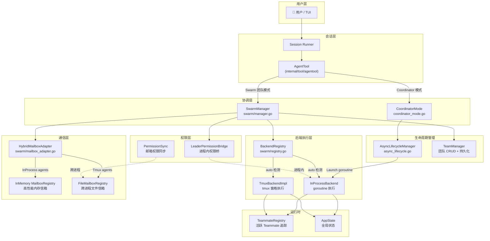
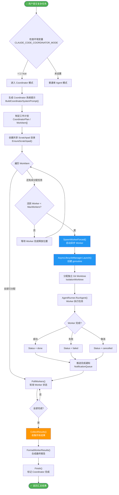
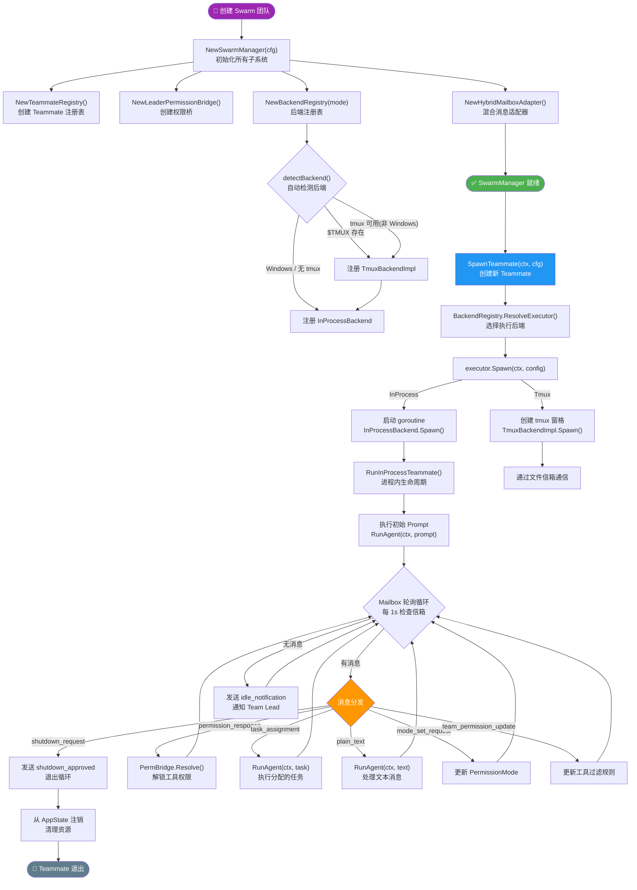
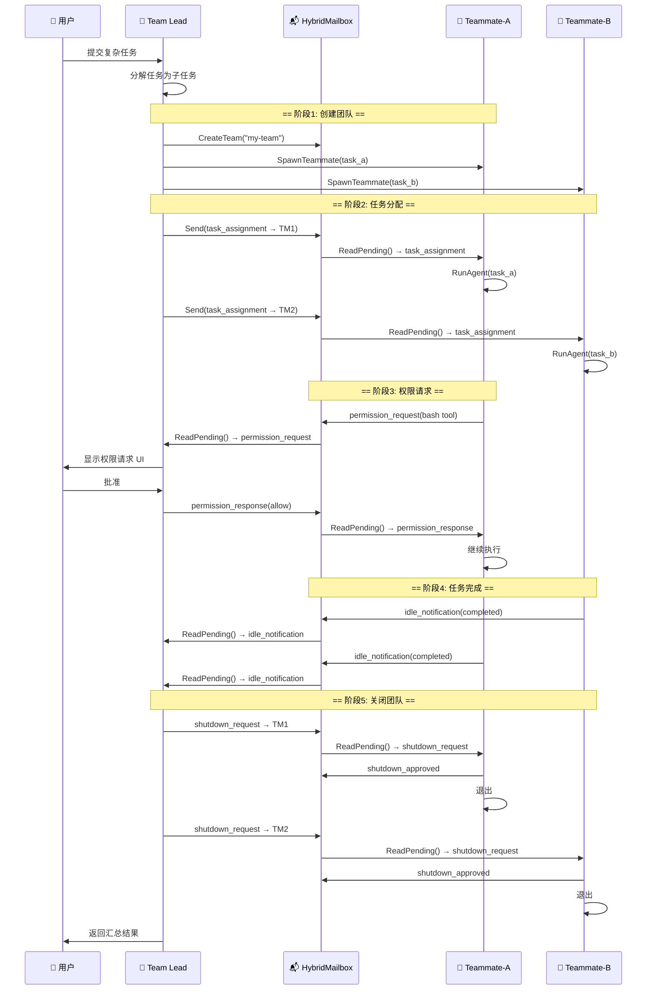
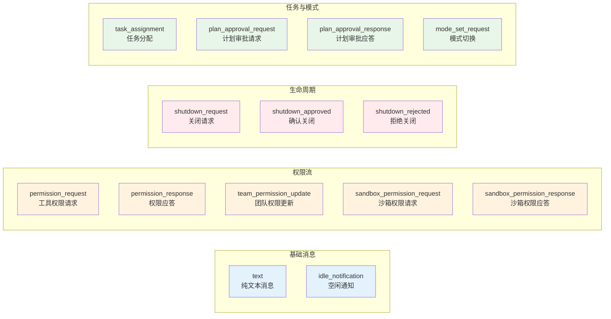
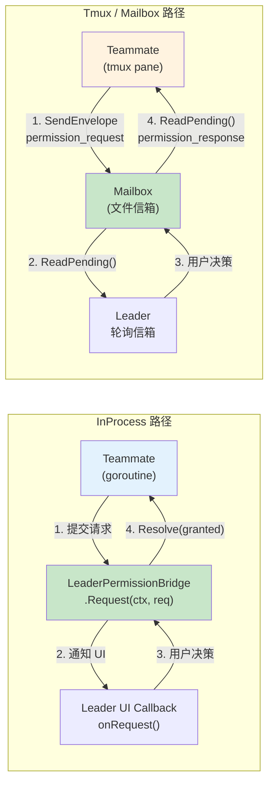
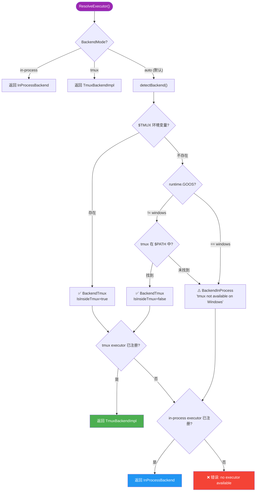
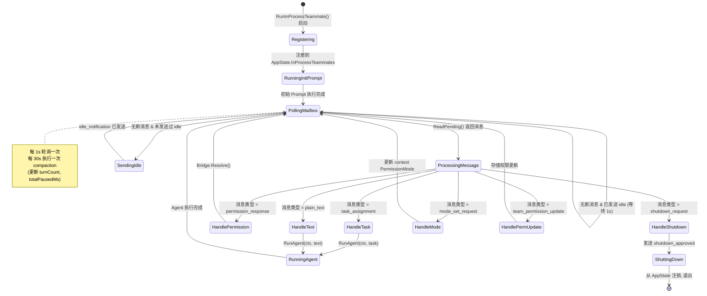

# 多智能体协作与 Swarm 技术 — 业务流程图

> 本文档基于 `open-claudecode-go` 代码库，详细描述多智能体协作架构、两种协作模式及其业务流程。

---

## 1. 系统整体架构



---

## 2. Coordinator 模式流程

> **适用场景**: 复杂任务需拆分为多个独立子任务并行执行，每个 Worker 在独立 Git Worktree 中工作。



### Coordinator 模式关键约束

| 约束 | 值 | 来源 |
|------|---|------|
| 最大并发 Worker | `MaxWorkers`（默认 4） | `CoordinatorConfig` |
| 每 Worker 最大轮次 | `MaxTurnsPerWorker`（默认 100） | `CoordinatorConfig` |
| Worker 隔离方式 | Git Worktree | `IsolationWorktree` |
| Worker 可用工具 | Task, Read, Grep, Glob, Bash, Edit... | `CoordinatorAllowedTools` |
| 协调者可用工具 | Task, Read, Grep, Glob, TodoRead, TodoWrite | 仅读取+派发 |

---

## 3. Swarm 团队模式流程

> **适用场景**: 需要持续协作的团队场景，Team Lead 与多个 Teammate 通过消息信箱实时通信。



---

## 4. 消息通信时序图

> 展示 Team Lead 与 Teammate 之间的典型消息交互流程。



---

## 5. 消息类型一览

> 14 种结构化消息类型，定义于 `swarm/message_types.go`



---

## 6. 权限同步流程

> 两条路径：InProcess 通过 Bridge (低延迟)，Tmux 通过 Mailbox (跨进程)。



---

## 7. Backend 选择流程

> `BackendRegistry.ResolveExecutor()` 的决策逻辑。



---

## 8. InProcess Teammate 完整生命周期

> `RunInProcessTeammate()` 的完整状态机。



---

## 9. 两种模式对比

| 维度 | Coordinator 模式 | Swarm 团队模式 |
|------|-----------------|---------------|
| **入口** | `CoordinatorMode.SpawnWorkerForced()` | `SwarmManager.SpawnTeammate()` |
| **通信方式** | 无直接通信，通过 Scratchpad 共享文件 | 结构化 Mailbox 消息（14 种类型） |
| **隔离级别** | Git Worktree（文件系统级隔离） | Context 隔离 / Tmux Pane 隔离 |
| **生命周期** | 一次性任务：启动 → 执行 → 完成 | 持续运行：轮询信箱直到收到 shutdown |
| **并发管理** | `AsyncLifecycleManager`（goroutine + 状态轮询） | `TeammateExecutor`（InProcess / Tmux） |
| **权限模型** | Worker 继承 Coordinator 权限 | Leader 实时审批（Bridge / Mailbox） |
| **状态追踪** | `CoordinatorWorker.Status` | `AppState.InProcessTeammates` + `TeammateRegistry` |
| **适用场景** | 大规模并行代码修改 | 需要实时协作、权限管控的团队任务 |

---

## 10. 快速使用指南

### 启用 Swarm 功能
```bash
export AGENT_SWARMS_ENABLED=1
```

### 启用 Coordinator 模式
```bash
export CLAUDE_CODE_COORDINATOR_MODE=1
```

### 核心 API 调用链

```
# Swarm 团队模式
SwarmManagerConfig → NewSwarmManager() → SwarmManager
  ├── .SpawnTeammate(ctx, TeammateSpawnConfig)  → SpawnOutput
  ├── .SendMessage(from, to, text, priority)    → msgID
  ├── .BroadcastMessage(from, team, text)       → error
  ├── .ShutdownTeammate(agentID, reason)        → error
  └── .ShutdownAll(reason)                      → void

# Coordinator 模式
CoordinatorConfig → NewCoordinatorMode(runner, asyncMgr, loader, cfg) → CoordinatorMode
  ├── .SetPlan(CoordinatorPlan)
  ├── .SpawnWorkerForced(ctx, WorkItem, parentCtx) → agentID
  ├── .PollWorkers()                               → []completedIDs
  ├── .WaitAll(timeout)                            → error
  ├── .CollectResults()                            → map[agentID]*AgentRunResult
  └── .Finish()
```
